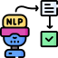
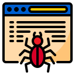
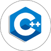

# Hello there :wave:

#### I'm Sagiv, a SOFTWARE DEVELOPER ⚡🔭
My experience includes coding using Python, Java, C++, C, and many more. Over the course of my career, I have designed and developed efficient and scalable solutions using my expertise in data structures, algorithms, and software architecture principles.

~ Currently in Uni, studying my final semester of B.Sc in CS at Bar Ilan University.

<!-- ~ I'm currently working on adding random features to a fork of XV6 for Operating Systems class. -->
##

###
# Experienced in:
# Building AI & Cyber Tools
 [][4] [][6]  [][7]   [][9] [][10] [][11]  [][12]   [][13]

 
<!--  
 # Building Cyber Tools -->
 
 # Projects in different programming languages
 [][2]  [][3]   [][5]   [][8]

##### Random things about yours truly:
* Currently I work at the Cyber Education Center in Magshimim as a Project Leader.
* Participates in many hackathons.
* Toga's Hackathon finalist.
* Scored 100 in the OOP and Advanced Programming courses, 93 in Algorithms.

<!-- ##
💬 Ask me about why Unholy Bobas are the best dampened switch in existence. Or just any entry keyboard question because I've been using entry custom boards for the past 3 years.
 -->
### Reach me:

[][1]

[1]: https://www.linkedin.com/in/sagiv-antebi/
[2]: https://github.com/sagivantebi/ArkanoidGame-Java
[3]: https://github.com/sagivantebi/Anomaly_Detector-Cpp
[4]: https://github.com/sagivantebi/C.S_Assignments
[5]: https://github.com/sagivantebi/mini_Shell-C
[6]: https://github.com/sagivantebi/Vocal_Waiting_Time_Assistant-Python
[7]: https://github.com/sagivantebi/DaliDoodle-Development-AWS
[8]: https://github.com/sagivantebi/Web_Caht
[9]: https://github.com/sagivantebi/C.S_Assignments/tree/main/AI
[10]: https://github.com/sagivantebi/Ransomware_Detection_Toga_Hackathon
[11]: https://github.com/sagivantebi/Cloud_Simulator-Python
[12]: https://github.com/sagivantebi/Web_Crawler-Python
[13]: https://github.com/sagivantebi/DNS_Spoofing

<!--
**ThatGuyVanquish/ThatGuyVanquish** is a ✨ _special_ ✨ repository because its `README.md` (this file) appears on your GitHub profile.

Here are some ideas to get you started:

- 🔭 I’m currently working on ...
- 🌱 I’m currently learning ...
- 👯 I’m looking to collaborate on ...
- 🤔 I’m looking for help with ...
- 💬 Ask me about ...
- 📫 How to reach me: ...
- 😄 Pronouns: ...
- ⚡ Fun fact: ...
-->
