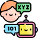

# Hello there :wave:

#### I'm Sagiv, a keyboard enthusiast that obviously got into the hobby because I program since I was 14, not because of "Fjell with lubed Holy Pandas".
~ Currently in Uni, studying my final semester of B.Sc in CS at Bar Ilan University.

~ I'm currently working on adding random features to a fork of XV6 for Operating Systems class.
##

###
Experienced in:
# AI Tools
 [][4] [][6]  [][7]   [][9]
 
 
 # Building Cyber Tools
[][10] [][11]  [][12]   [][13]
 
  # Projects in different programming languages
 [][2]  [][3]   [][5]   [][8]

##### Random things about yours truly:
* Upgrading from Windows to Arch Linux (Manjaro)
* Scored 100 in the Systems Programming course, 92 in Compiler Construction and 100 in Introduction to 3D Animations with OpenGL.
* I daily an ergonomic keyboard with lubed and filmed Holy Bobas.
* Interned at Cybereason, where I've built a [dashboard](https://github.com/ThatGuyVanquish/CRStarshipDemo) to monitor Kubernetes on GCP through Prometheus.
* Love computer hardware, built my first computer at 13, then proceeded to physically modify it and overclock. Probably the reason I built my [Qt PC Part Picker](https://github.com/ThatGuyVanquish/QtPCPartPicker)(WIP).

##
💬 Ask me about why Unholy Bobas are the best dampened switch in existence. Or just any entry keyboard question because I've been using entry custom boards for the past 3 years.

### Reach me:

[][1]

[1]: https://www.linkedin.com/in/sagiv-antebi/
[2]: https://github.com/ThatGuyVanquish/SPL-Assignment-2
[3]: https://github.com/ThatGuyVanquish/3DAnimations_FP
[4]: https://github.com/ThatGuyVanquish/QtPCPartPicker
[5]: https://github.com/ThatGuyVanquish/ESPL
[6]: https://github.com/ThatGuyVanquish/CC_FP
[7]: https://github.com/ThatGuyVanquish/CC_AS2
[8]: https://github.com/ThatGuyVanquish/ThatGuyVanquish
[9]: https://github.com/ThatGuyVanquish/PPL-Assignment-4

<!--
**ThatGuyVanquish/ThatGuyVanquish** is a ✨ _special_ ✨ repository because its `README.md` (this file) appears on your GitHub profile.

Here are some ideas to get you started:

- 🔭 I’m currently working on ...
- 🌱 I’m currently learning ...
- 👯 I’m looking to collaborate on ...
- 🤔 I’m looking for help with ...
- 💬 Ask me about ...
- 📫 How to reach me: ...
- 😄 Pronouns: ...
- ⚡ Fun fact: ...
-->
